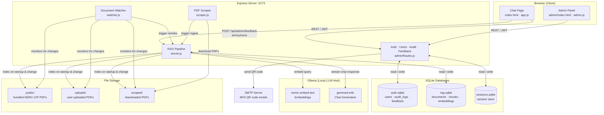

# NERC-CIP AI Agent

A secure, compliance-focused AI assistant for querying NERC-CIP (North American Electric Reliability Corporation — Critical Infrastructure Protection) standards and documentation. Built with a local RAG (Retrieval-Augmented Generation) pipeline, JWT-based authentication, role-based access control, and an admin panel for user and document management.

---

## Architecture



---

## File Navigation

```
NERC-CIP_AI_Agent/
├── docker-compose.yml              # Docker Compose config (UI container + Ollama bridge)
├── README.md
│
├── ollama/                         # Ollama model configuration files
│
└── ui/                             # Main application (Node.js)
    ├── server.js                   # Express entry point — routes, RAG pipeline, chat streaming
    ├── adminRoutes.js              # Auth, user management, audit log, and feedback API routes
    ├── ragdb.js                    # RAG SQLite DB — documents, chunks, embeddings
    ├── db.js                       # Legacy DB helper (largely superseded by ragdb.js)
    ├── scraper.js                  # PDF scraping pipeline (discovers and downloads NERC-CIP PDFs)
    ├── watcher.js                  # Document change watcher (auto-triggers re-ingestion)
    ├── package.json
    ├── package-lock.json
    │
    ├── auth/                       # Session-based auth (legacy path, JWT used by default)
    │   ├── auth.middleware.js
    │   ├── auth.routes.js
    │   └── auth.service.js
    │
    ├── scripts/
    │   └── create-admin.js         # One-off script to seed an admin user
    │
    ├── public/                     # Static frontend files (served at /)
    │   ├── index.html              # Main chat page (login + chat UI)
    │   ├── app.js                  # Chat page JavaScript
    │   ├── styles.css              # Chat page styles
    │   ├── srp-logo.webp           # Brand logo
    │   ├── *.pdf                   # Bundled NERC-CIP standard PDFs (auto-indexed on startup)
    │   │
    │   └── admin/                  # Admin panel (served at /admin/)
    │       ├── index.html          # Admin dashboard
    │       ├── admin.js            # Admin panel JavaScript
    │       └── admin.css           # Admin panel styles
    │
    ├── data/                       # Runtime data (created automatically)
    │   ├── auth.sqlite             # Users, audit logs, feedback
    │   ├── rag.sqlite              # Documents, chunks, vector embeddings
    │   └── sessions.sqlite         # Express session store
    │
    ├── uploads/                    # User-uploaded PDFs (auto-indexed)
    ├── scraped/                    # PDFs downloaded by the scraping pipeline
    └── cache/                      # Embedding cache
```

### Key API Routes

| Method | Path | Auth | Description |
|--------|------|------|-------------|
| POST | `/api/admin/register` | None | Self-register a new operator account |
| POST | `/api/admin/login` | None | Login — returns JWT |
| GET | `/api/admin/users` | JWT (admin) | List all users |
| POST | `/api/admin/users` | JWT (admin) | Create a user |
| PUT | `/api/admin/users/:id` | JWT (admin) | Update a user |
| DELETE | `/api/admin/users/:id` | JWT (admin) | Delete a user |
| POST | `/api/admin/users/:id/mfa/setup` | JWT (admin) | Set up TOTP MFA (emails QR code) |
| POST | `/api/admin/users/:id/mfa/disable` | JWT (admin) | Disable MFA |
| GET | `/api/admin/audit` | JWT (admin) | Retrieve audit log |
| POST | `/api/admin/feedback` | None (anonymous) | Submit anonymous feedback |
| GET | `/api/admin/feedback` | JWT (admin) | View all feedback submissions |
| DELETE | `/api/admin/feedback/:id` | JWT (admin) | Delete a feedback entry |
| POST | `/api/chat` | JWT | Stream a chat response (NDJSON) |
| GET | `/api/corpus` | JWT | Document corpus statistics |
| POST | `/api/reindex` | JWT | Re-index all PDFs |
| POST | `/api/scrape` | JWT (admin) | Run the scraping pipeline |
| GET | `/api/scrape/status` | JWT (admin) | Scraper manifest |
| GET | `/api/watcher/status` | JWT (admin) | Document watcher status |
| POST | `/api/watcher/scan` | JWT (admin) | Trigger a manual watcher scan |

---

## Installation

### Prerequisites

- [Node.js](https://nodejs.org/) v18 or higher
- [Docker](https://www.docker.com/) and Docker Compose (for containerised deployment)
- [Ollama](https://ollama.com/) — runs the local LLM and embedding model
- NVIDIA GPU recommended for acceptable inference speed

### 1. Clone the Repository

```bash
git clone https://github.com/andrew-wrightt/NERC-CIP_AI_Agent.git
cd NERC-CIP_AI_Agent
```

### 2. Start Ollama and Pull Models

```bash
# Verify GPU is available
nvidia-smi

# Start Ollama container with GPU support
docker run -d --name ollama --gpus all -p 11434:11434 -v ollama:/root/.ollama ollama/ollama:latest

# Pull required models
docker exec -it ollama ollama pull gemma4:e4b
docker exec -it ollama ollama pull nomic-embed-text

# Verify models loaded
docker exec -it ollama ollama list

# Optional sanity check
docker exec -it ollama ollama run gemma4:e4b "Say 'GPU test ok' and nothing else."
```

### 3a. Run with Docker Compose (Recommended)

```bash
docker compose up -d --build
```

The app will be available at `http://localhost:5173`.

To stop:
```bash
docker stop ollama
docker compose down
```

### 3b. Run Locally (Without Docker)

```bash
cd ui
npm install

# Create required data directories
mkdir -p data uploads cache scraped

# Start the server
npm start
```

### 4. Environment Variables

Create a `.env` file in `ui/` (or set these in `docker-compose.yml`):

| Variable | Default | Description |
|----------|---------|-------------|
| `OLLAMA_URL` | `http://localhost:11434` | Ollama API endpoint |
| `JWT_SECRET` | *(insecure default)* | **Change in production** |
| `SESSION_SECRET` | *(insecure default)* | **Change in production** |
| `SCRAPE_SOURCES` | *(built-in NERC URLs)* | Comma-separated URLs for PDF scraping |
| `WATCH_INTERVAL_MS` | `300000` | Document watcher poll interval (ms) |
| `DISABLE_WATCHER` | `false` | Set `"true"` to disable the watcher |
| `SMTP_HOST` | — | SMTP server for MFA QR code emails |
| `SMTP_PORT` | `587` | SMTP port |
| `SMTP_USER` | — | SMTP username |
| `SMTP_PASS` | — | SMTP password |
| `SMTP_FROM` | *(SMTP_USER)* | From address for MFA emails |
| `MFA_ISSUER` | `NERC-CIP AI Agent` | Name shown in authenticator apps |

### 5. Default Login

| Username | Password |
|----------|----------|
| `admin` | `admin123` |

**Change the default password immediately in any non-development environment.**

To create an additional admin via script:
```bash
docker compose exec ui node scripts/create-admin.js <username> <password>
```

---

## Licenses

No project-level license file is included in this repository. All third-party packages listed below carry their own licenses (predominantly MIT); refer to the `LICENSE` file within each package under `ui/node_modules/` for details.

---

## Libraries

All packages are Node.js dependencies declared in `ui/package.json`.

| Package | Version | License | Purpose | Source |
|---------|---------|---------|---------|--------|
| [express](https://expressjs.com/) | 4.22.1 | MIT | HTTP server and routing framework | [npmjs.com](https://www.npmjs.com/package/express) |
| [better-sqlite3](https://github.com/WiseLibs/better-sqlite3) | 12.6.2 | MIT | Synchronous SQLite3 bindings (auth, RAG, sessions DB) | [npmjs.com](https://www.npmjs.com/package/better-sqlite3) |
| [express-session](https://github.com/expressjs/session) | 1.19.0 | MIT | Server-side session middleware | [npmjs.com](https://www.npmjs.com/package/express-session) |
| [connect-sqlite3](https://github.com/rawberg/connect-sqlite3) | 0.9.16 | MIT | SQLite session store for express-session | [npmjs.com](https://www.npmjs.com/package/connect-sqlite3) |
| [bcrypt](https://github.com/kelektiv/node.bcrypt.js) | 6.0.0 | MIT | Password hashing | [npmjs.com](https://www.npmjs.com/package/bcrypt) |
| [jsonwebtoken](https://github.com/auth0/node-jsonwebtoken) | 9.0.3 | MIT | JWT generation and verification | [npmjs.com](https://www.npmjs.com/package/jsonwebtoken) |
| [uuid](https://github.com/uuidjs/uuid) | 9.0.1 | MIT | UUID v4 generation for DB primary keys | [npmjs.com](https://www.npmjs.com/package/uuid) |
| [multer](https://github.com/expressjs/multer) | 1.4.5-lts.2 | MIT | Multipart form / file upload handling | [npmjs.com](https://www.npmjs.com/package/multer) |
| [node-fetch](https://github.com/node-fetch/node-fetch) | 3.3.2 | MIT | HTTP client for Ollama API calls | [npmjs.com](https://www.npmjs.com/package/node-fetch) |
| [pdf-parse](https://gitlab.com/autokent/pdf-parse) | 1.1.4 | MIT | PDF text extraction for RAG indexing | [npmjs.com](https://www.npmjs.com/package/pdf-parse) |
| [nodemailer](https://nodemailer.com/) | 6.10.1 | MIT | SMTP email delivery for MFA QR codes | [npmjs.com](https://www.npmjs.com/package/nodemailer) |
| [otplib](https://github.com/yeojz/otplib) | 12.0.1 | MIT | TOTP/HOTP one-time password generation and verification | [npmjs.com](https://www.npmjs.com/package/otplib) |
| [qrcode](https://github.com/soldair/node-qrcode) | 1.5.4 | MIT | QR code image generation for MFA setup | [npmjs.com](https://www.npmjs.com/package/qrcode) |

### Frontend (CDN — no install required)

| Library | Version | License | Purpose | Source |
|---------|---------|---------|---------|--------|
| [marked.js](https://marked.js.org/) | 12.0.2 | MIT | Markdown rendering in chat bubbles | [cdnjs.cloudflare.com](https://cdnjs.cloudflare.com/ajax/libs/marked/12.0.2/marked.min.js) |

---

## API / SDK

### Ollama REST API

Used internally by the server to generate embeddings and stream chat completions. No API key is required — Ollama runs entirely on-premises.

| Endpoint | Method | Model Used | Description |
|----------|--------|------------|-------------|
| `/api/embeddings` | POST | `nomic-embed-text` | Generate vector embeddings for RAG indexing and query retrieval |
| `/api/chat` | POST | `gemma4:e4b` | Stream chat completions (NDJSON) for user queries |

**Default base URL:** `http://localhost:11434` (configurable via `OLLAMA_URL` environment variable)

**Ollama version:** Self-hosted — pull the latest image via Docker Hub (`ollama/ollama:latest`)
**Ollama documentation:** [https://github.com/ollama/ollama](https://github.com/ollama/ollama)

#### Models

| Model | Purpose | Pull Command |
|-------|---------|-------------|
| `gemma4:e4b` | Chat / answer generation (4-bit quantised Gemma 4 26B MoE) | `ollama pull gemma4:e4b` |
| `nomic-embed-text` | Text embeddings for semantic search | `ollama pull nomic-embed-text` |

---

## How the System Works

### 1. Document Ingestion

On startup, the server scans the `public/`, `uploads/`, and `scraped/` directories for PDF files. Each PDF is parsed using `pdf-parse`, split into overlapping text chunks (~1,000 characters each with 100-character overlap), and embedded using the `nomic-embed-text` model via Ollama. Chunks and their vector embeddings are stored in `rag.sqlite`. SHA-256 hashing prevents re-processing unchanged files.

The **Document Change Watcher** polls these directories on a configurable interval (default: 5 minutes). If a file is added, modified, or deleted, it automatically triggers re-ingestion for only the affected documents.

The **Scraping Pipeline** can be triggered manually from the Admin Panel or run on demand. It fetches PDF links from configured NERC-CIP source URLs, downloads new or changed files into `scraped/`, and logs results to a manifest file for deduplication.

### 2. Chat and Retrieval (RAG Pipeline)

When a user sends a message:

1. The query is embedded using `nomic-embed-text`.
2. A **hybrid retrieval** step runs — cosine similarity is computed against all stored chunk embeddings, combined with a keyword frequency score, to select the top-K most relevant chunks.
3. The retrieved chunks are assembled into a system prompt that grounds the model in the source documents.
4. The prompt and conversation history are sent to `gemma4:e4b` via the Ollama `/api/chat` endpoint, which streams the response back as NDJSON.
5. The frontend receives the stream, renders the assistant's reply in Markdown, and attaches source citation chips linking to the relevant PDF pages.

### 3. Authentication Flow

1. A user submits credentials to `POST /api/admin/login`.
2. The server verifies the password hash (bcrypt), checks account status and lockout state, and optionally validates a TOTP code if MFA is enabled.
3. On success, a signed JWT (2-hour expiry) is returned and stored in `sessionStorage`.
4. All protected API requests attach the token as `Authorization: Bearer <token>`. The server middleware verifies the JWT and resolves the user's role before passing the request to the route handler.
5. After 5 consecutive failed login attempts, the account is locked for 15 minutes.

### 4. Anonymous Feedback

Any user (authenticated or not) can submit feedback via the **Feedback** button in the topbar. The message and optional 1–5 star rating are posted to `POST /api/admin/feedback`. No user identity, IP address, or session information is stored — only the message text, rating, and timestamp. Admins can view and delete submissions from the **Feedback** tab in the Admin Panel.

---

## Inputs and Outputs

### Inputs

| Source | Input | Description |
|--------|-------|-------------|
| User (chat) | Natural language question | Queried against indexed NERC-CIP documents via RAG |
| User (feedback) | Text message + optional star rating (1–5) | Stored anonymously |
| Admin | PDF / text file upload | Ingested and indexed into the RAG database |
| Admin | Scrape trigger + optional URL | Fetches and indexes NERC-CIP PDFs from external sources |
| Admin | User management actions | Create, update, or delete operator/admin accounts |
| File system | PDF files in `public/`, `uploads/`, `scraped/` | Auto-indexed on startup and when changes are detected |
| Environment | `.env` / `docker-compose.yml` variables | Server configuration (Ollama URL, secrets, SMTP, etc.) |

### Outputs

| Destination | Output | Description |
|-------------|--------|-------------|
| User (chat) | Streamed Markdown response | AI-generated answer grounded in NERC-CIP source documents |
| User (chat) | Source citation chips | Clickable links to the specific PDF pages used in the answer |
| Admin Panel | User list | Table of all accounts with role, status, MFA state, and last login |
| Admin Panel | Audit log | Timestamped record of all authentication and admin events |
| Admin Panel | Feedback list | Anonymous feedback submissions with ratings and timestamps |
| Admin Panel | Scraper results | Count of discovered, downloaded, and unchanged PDFs |
| Admin Panel | Watcher status | Directory scan history and change detection results |
| Email (SMTP) | MFA QR code | Sent to the address provided when setting up TOTP MFA |
| `rag.sqlite` | Documents, chunks, embeddings | Persisted RAG index for all ingested PDFs |
| `auth.sqlite` | Users, audit logs, feedback | Persisted authentication and operational data |

---

## Services and Features

### Core Services

| Service | File | Description |
|---------|------|-------------|
| Express HTTP Server | `server.js` | Serves static frontend, REST API, and chat streaming endpoint |
| RAG Pipeline | `server.js` | Embeds documents and queries; performs hybrid retrieval; builds grounded prompts |
| Authentication & Auth API | `adminRoutes.js` | JWT login, registration, account lockout, role-based access control |
| Document Change Watcher | `watcher.js` | Polls watched directories and triggers re-ingestion on file changes |
| PDF Scraping Pipeline | `scraper.js` | Discovers and downloads NERC-CIP PDFs from configured source URLs |

### Features

**Chat Interface**
- Streaming AI responses grounded in indexed NERC-CIP documents
- Inline `[1]`, `[2]` citation links rendered in the assistant's response
- Clickable source chips that open the relevant PDF page in a side panel
- Conversation history maintained per session
- Dark / light theme toggle

**Authentication & Security**
- JWT-based authentication with 2-hour token expiry
- bcrypt password hashing (12 rounds)
- Account lockout after 5 failed login attempts (15-minute lockout)
- Role-based access control: `admin` and `operator` roles
- Optional TOTP multi-factor authentication with QR code delivery via email
- Full audit logging of all authentication and administrative events

**Admin Panel**
- User management: create, edit, delete accounts; assign roles and status
- MFA setup and disable per user
- Audit log viewer with event-type filtering
- Document ingestion controls: manual scrape trigger, manifest inspection
- Document Watcher status, manual scan trigger, and change history
- Anonymous feedback viewer with per-entry deletion
- System status and NERC-CIP compliance checklist

**Document Management**
- Auto-indexing of bundled NERC-CIP PDFs on startup
- File upload ingestion (PDF, text, Markdown)
- SHA-256 deduplication — unchanged files are never re-processed
- Versioned standard tracking (e.g., CIP-005-6 supersedes CIP-005-5)
- Automatic re-ingestion when the Document Watcher detects changes

**Anonymous Feedback**
- Feedback button available to all logged-in users from the topbar
- Optional 1–5 star rating plus free-text message
- Zero personally identifiable information collected or stored

---

## Best Practices

### Code Updates and Maintenance

- **Single responsibility per file.** `server.js` owns the RAG pipeline and chat route; `adminRoutes.js` owns auth and admin API; `ragdb.js` owns the RAG schema. Keep new features in the appropriate file and avoid cross-cutting concerns.
- **Use prepared statements for all SQL.** `better-sqlite3` prepared statements are defined at module load time. Never interpolate user input directly into SQL strings — always bind parameters.
- **Schema migrations via `ensureColumn`.** The existing `ensureColumn()` helper adds new columns to SQLite tables without wiping data. Use this pattern for any schema change rather than dropping and recreating tables.
- **Test with real data before deploying.** The RAG pipeline's quality is sensitive to chunking parameters and embedding model changes. After any modification to `chunkText()`, `embedTextSingle()`, or retrieval scoring, re-index a known PDF and verify citation quality in the chat before pushing.
- **Environment variables for all secrets.** `JWT_SECRET` and `SESSION_SECRET` must never be committed. Rotate them if they are ever exposed.
- **Keep the Document Watcher and Scraper idempotent.** Both components rely on SHA-256 deduplication. Any change to hashing or ingestion logic must preserve this property to avoid duplicate chunks in the RAG index.

### API, SDK, and Library Updates

- **Pin exact versions in production.** The `package-lock.json` already locks resolved versions. Do not run `npm update` blindly — review changelogs for `better-sqlite3`, `bcrypt`, and `jsonwebtoken` before upgrading, as these have native bindings or security-sensitive behaviour.
- **`better-sqlite3` requires a native rebuild after Node.js upgrades.** After updating Node.js, run `npm rebuild better-sqlite3` inside the container or locally before restarting.
- **Monitor security advisories.** Run `npm audit` regularly. Critical severity issues in auth-related packages (`bcrypt`, `jsonwebtoken`, `express-session`) should be patched immediately. Use `npm audit fix` only after reviewing what it changes.
- **Ollama model updates are independent of the application.** Pull updated models (`ollama pull gemma4:e4b`) without changing application code. After a model update, re-run a suite of representative queries to verify answer quality and citation accuracy have not regressed.
- **marked.js is loaded from CDN.** Pin the version in the `<script>` src URL (`/12.0.2/`) to prevent unexpected breaking changes from a CDN alias. Update it deliberately by changing the URL and testing Markdown rendering.
- **When upgrading `pdf-parse`**, re-index a sample of PDFs from `public/` and verify chunk content is correct — the library's extraction behaviour can change between versions.

### Repository and Version Management

- **Branch strategy.** Use feature branches off `main` (e.g., `feature/feedback`, `fix/auth-lockout`). Merge via pull request after review. Avoid long-lived branches to reduce merge conflicts.
- **Commit message conventions.** Use the imperative mood with a short subject line (≤72 characters). Reference the area changed: `auth:`, `rag:`, `admin:`, `ui:`, `docs:`. Example: `auth: increase bcrypt rounds to 14`.
- **Tag releases.** Before deploying, create an annotated Git tag: `git tag -a v1.2.0 -m "v1.2.0 — feedback feature, admin UI refresh"`. This makes it easy to roll back with `git checkout v1.1.0`.
- **Keep `package-lock.json` committed.** It guarantees reproducible installs across environments. Never `.gitignore` it.
- **Do not commit runtime data.** The `ui/data/`, `ui/uploads/`, `ui/cache/`, and `ui/scraped/` directories contain generated runtime files and are (or should be) in `.gitignore`. Only source files and bundled PDFs belong in the repository.
- **Docker image versioning.** Tag built images with the Git commit SHA or release tag: `docker build -t nerc-cip-agent:v1.2.0 .`. This makes deployments auditable and rollbacks straightforward.

### Licensing Management

- **This repository has no declared license.** This means copyright is retained by default — no one outside the project team has the legal right to use, copy, or distribute the code. If the intent is to open-source it, add a `LICENSE` file (MIT is consistent with all current dependencies). If it is intended to remain proprietary, document that explicitly.
- **All current npm dependencies are MIT licensed.** MIT permits use in proprietary and commercial software with no copyleft obligations. Keep this in mind when evaluating replacement packages — avoid adding AGPL or GPL-licensed packages without legal review, as these can impose distribution obligations.
- **Ollama is MIT licensed.** The `gemma4` model weights are distributed under Google's Gemma Terms of Use, which permits non-commercial and research use but restricts certain commercial deployments. Review the terms at [ai.google.dev/gemma/terms](https://ai.google.dev/gemma/terms) before any production or commercial deployment.
- **`nomic-embed-text` is released under Apache 2.0**, which is permissive and compatible with commercial use.
- **CDN-hosted libraries (marked.js).** When hosting the application publicly, be aware that loading scripts from `cdnjs.cloudflare.com` creates a third-party dependency at runtime. For air-gapped or high-security deployments, vendor the script into `public/` instead.
- **Domain and hosting services.** If this application is deployed to a cloud provider or behind a custom domain, ensure any service agreements are reviewed for data residency requirements — particularly relevant given the NERC-CIP compliance context. No user data or document content should leave the on-premises environment without an explicit compliance review.
