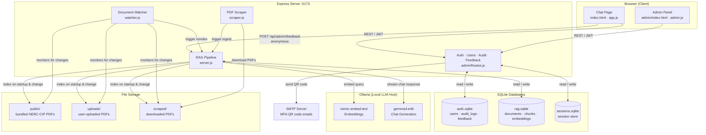

# NERC-CIP AI Agent

A secure, compliance-focused AI assistant for querying NERC-CIP (North American Electric Reliability Corporation — Critical Infrastructure Protection) standards and documentation. Built with a local RAG (Retrieval-Augmented Generation) pipeline, JWT-based authentication, role-based access control, and an admin panel for user and document management.

---

## Architecture



---

## File Navigation

```
NERC-CIP_AI_Agent/
├── docker-compose.yml              # Docker Compose config (UI container + Ollama bridge)
├── README.md
│
├── ollama/                         # Ollama model configuration files
│
└── ui/                             # Main application (Node.js)
    ├── server.js                   # Express entry point — routes, RAG pipeline, chat streaming
    ├── adminRoutes.js              # Auth, user management, audit log, and feedback API routes
    ├── ragdb.js                    # RAG SQLite DB — documents, chunks, embeddings
    ├── db.js                       # Legacy DB helper (largely superseded by ragdb.js)
    ├── scraper.js                  # PDF scraping pipeline (discovers and downloads NERC-CIP PDFs)
    ├── watcher.js                  # Document change watcher (auto-triggers re-ingestion)
    ├── package.json
    ├── package-lock.json
    │
    ├── auth/                       # Session-based auth (legacy path, JWT used by default)
    │   ├── auth.middleware.js
    │   ├── auth.routes.js
    │   └── auth.service.js
    │
    ├── scripts/
    │   └── create-admin.js         # One-off script to seed an admin user
    │
    ├── public/                     # Static frontend files (served at /)
    │   ├── index.html              # Main chat page (login + chat UI)
    │   ├── app.js                  # Chat page JavaScript
    │   ├── styles.css              # Chat page styles
    │   ├── srp-logo.webp           # Brand logo
    │   ├── *.pdf                   # Bundled NERC-CIP standard PDFs (auto-indexed on startup)
    │   │
    │   └── admin/                  # Admin panel (served at /admin/)
    │       ├── index.html          # Admin dashboard
    │       ├── admin.js            # Admin panel JavaScript
    │       └── admin.css           # Admin panel styles
    │
    ├── data/                       # Runtime data (created automatically)
    │   ├── auth.sqlite             # Users, audit logs, feedback
    │   ├── rag.sqlite              # Documents, chunks, vector embeddings
    │   └── sessions.sqlite         # Express session store
    │
    ├── uploads/                    # User-uploaded PDFs (auto-indexed)
    ├── scraped/                    # PDFs downloaded by the scraping pipeline
    └── cache/                      # Embedding cache
```

### Key API Routes

| Method | Path | Auth | Description |
|--------|------|------|-------------|
| POST | `/api/admin/register` | None | Self-register a new operator account |
| POST | `/api/admin/login` | None | Login — returns JWT |
| GET | `/api/admin/users` | JWT (admin) | List all users |
| POST | `/api/admin/users` | JWT (admin) | Create a user |
| PUT | `/api/admin/users/:id` | JWT (admin) | Update a user |
| DELETE | `/api/admin/users/:id` | JWT (admin) | Delete a user |
| POST | `/api/admin/users/:id/mfa/setup` | JWT (admin) | Set up TOTP MFA (emails QR code) |
| POST | `/api/admin/users/:id/mfa/disable` | JWT (admin) | Disable MFA |
| GET | `/api/admin/audit` | JWT (admin) | Retrieve audit log |
| POST | `/api/admin/feedback` | None (anonymous) | Submit anonymous feedback |
| GET | `/api/admin/feedback` | JWT (admin) | View all feedback submissions |
| DELETE | `/api/admin/feedback/:id` | JWT (admin) | Delete a feedback entry |
| POST | `/api/chat` | JWT | Stream a chat response (NDJSON) |
| GET | `/api/corpus` | JWT | Document corpus statistics |
| POST | `/api/reindex` | JWT | Re-index all PDFs |
| POST | `/api/scrape` | JWT (admin) | Run the scraping pipeline |
| GET | `/api/scrape/status` | JWT (admin) | Scraper manifest |
| GET | `/api/watcher/status` | JWT (admin) | Document watcher status |
| POST | `/api/watcher/scan` | JWT (admin) | Trigger a manual watcher scan |

---

## Installation

### Prerequisites

- [Node.js](https://nodejs.org/) v18 or higher
- [Docker](https://www.docker.com/) and Docker Compose (for containerised deployment)
- [Ollama](https://ollama.com/) — runs the local LLM and embedding model
- NVIDIA GPU recommended for acceptable inference speed

### 1. Clone the Repository

```bash
git clone https://github.com/andrew-wrightt/NERC-CIP_AI_Agent.git
cd NERC-CIP_AI_Agent
```

### 2. Start Ollama and Pull Models

```bash
# Verify GPU is available
nvidia-smi

# Start Ollama container with GPU support
docker run -d --name ollama --gpus all -p 11434:11434 -v ollama:/root/.ollama ollama/ollama:latest

# Pull required models
docker exec -it ollama ollama pull gemma4:e4b
docker exec -it ollama ollama pull nomic-embed-text

# Verify models loaded
docker exec -it ollama ollama list

# Optional sanity check
docker exec -it ollama ollama run gemma4:e4b "Say 'GPU test ok' and nothing else."
```

### 3a. Run with Docker Compose (Recommended)

```bash
docker compose up -d --build
```

The app will be available at `http://localhost:5173`.

To stop:
```bash
docker stop ollama
docker compose down
```

### 3b. Run Locally (Without Docker)

```bash
cd ui
npm install

# Create required data directories
mkdir -p data uploads cache scraped

# Start the server
npm start
```

### 4. Environment Variables

Create a `.env` file in `ui/` (or set these in `docker-compose.yml`):

| Variable | Default | Description |
|----------|---------|-------------|
| `OLLAMA_URL` | `http://localhost:11434` | Ollama API endpoint |
| `JWT_SECRET` | *(insecure default)* | **Change in production** |
| `SESSION_SECRET` | *(insecure default)* | **Change in production** |
| `SCRAPE_SOURCES` | *(built-in NERC URLs)* | Comma-separated URLs for PDF scraping |
| `WATCH_INTERVAL_MS` | `300000` | Document watcher poll interval (ms) |
| `DISABLE_WATCHER` | `false` | Set `"true"` to disable the watcher |
| `SMTP_HOST` | — | SMTP server for MFA QR code emails |
| `SMTP_PORT` | `587` | SMTP port |
| `SMTP_USER` | — | SMTP username |
| `SMTP_PASS` | — | SMTP password |
| `SMTP_FROM` | *(SMTP_USER)* | From address for MFA emails |
| `MFA_ISSUER` | `NERC-CIP AI Agent` | Name shown in authenticator apps |

### 5. Default Login

| Username | Password |
|----------|----------|
| `admin` | `admin123` |

**Change the default password immediately in any non-development environment.**

To create an additional admin via script:
```bash
docker compose exec ui node scripts/create-admin.js <username> <password>
```

---

## Licenses

No project-level license file is included in this repository. All third-party packages listed below carry their own licenses (predominantly MIT); refer to the `LICENSE` file within each package under `ui/node_modules/` for details.

---

## Libraries

All packages are Node.js dependencies declared in `ui/package.json`.

| Package | Version | License | Purpose | Source |
|---------|---------|---------|---------|--------|
| [express](https://expressjs.com/) | 4.22.1 | MIT | HTTP server and routing framework | [npmjs.com](https://www.npmjs.com/package/express) |
| [better-sqlite3](https://github.com/WiseLibs/better-sqlite3) | 12.6.2 | MIT | Synchronous SQLite3 bindings (auth, RAG, sessions DB) | [npmjs.com](https://www.npmjs.com/package/better-sqlite3) |
| [express-session](https://github.com/expressjs/session) | 1.19.0 | MIT | Server-side session middleware | [npmjs.com](https://www.npmjs.com/package/express-session) |
| [connect-sqlite3](https://github.com/rawberg/connect-sqlite3) | 0.9.16 | MIT | SQLite session store for express-session | [npmjs.com](https://www.npmjs.com/package/connect-sqlite3) |
| [bcrypt](https://github.com/kelektiv/node.bcrypt.js) | 6.0.0 | MIT | Password hashing | [npmjs.com](https://www.npmjs.com/package/bcrypt) |
| [jsonwebtoken](https://github.com/auth0/node-jsonwebtoken) | 9.0.3 | MIT | JWT generation and verification | [npmjs.com](https://www.npmjs.com/package/jsonwebtoken) |
| [uuid](https://github.com/uuidjs/uuid) | 9.0.1 | MIT | UUID v4 generation for DB primary keys | [npmjs.com](https://www.npmjs.com/package/uuid) |
| [multer](https://github.com/expressjs/multer) | 1.4.5-lts.2 | MIT | Multipart form / file upload handling | [npmjs.com](https://www.npmjs.com/package/multer) |
| [node-fetch](https://github.com/node-fetch/node-fetch) | 3.3.2 | MIT | HTTP client for Ollama API calls | [npmjs.com](https://www.npmjs.com/package/node-fetch) |
| [pdf-parse](https://gitlab.com/autokent/pdf-parse) | 1.1.4 | MIT | PDF text extraction for RAG indexing | [npmjs.com](https://www.npmjs.com/package/pdf-parse) |
| [nodemailer](https://nodemailer.com/) | 6.10.1 | MIT | SMTP email delivery for MFA QR codes | [npmjs.com](https://www.npmjs.com/package/nodemailer) |
| [otplib](https://github.com/yeojz/otplib) | 12.0.1 | MIT | TOTP/HOTP one-time password generation and verification | [npmjs.com](https://www.npmjs.com/package/otplib) |
| [qrcode](https://github.com/soldair/node-qrcode) | 1.5.4 | MIT | QR code image generation for MFA setup | [npmjs.com](https://www.npmjs.com/package/qrcode) |

### Frontend (CDN — no install required)

| Library | Version | License | Purpose | Source |
|---------|---------|---------|---------|--------|
| [marked.js](https://marked.js.org/) | 12.0.2 | MIT | Markdown rendering in chat bubbles | [cdnjs.cloudflare.com](https://cdnjs.cloudflare.com/ajax/libs/marked/12.0.2/marked.min.js) |

---

## API / SDK

### Ollama REST API

Used internally by the server to generate embeddings and stream chat completions. No API key is required — Ollama runs entirely on-premises.

| Endpoint | Method | Model Used | Description |
|----------|--------|------------|-------------|
| `/api/embeddings` | POST | `nomic-embed-text` | Generate vector embeddings for RAG indexing and query retrieval |
| `/api/chat` | POST | `gemma4:e4b` | Stream chat completions (NDJSON) for user queries |

**Default base URL:** `http://localhost:11434` (configurable via `OLLAMA_URL` environment variable)

**Ollama version:** Self-hosted — pull the latest image via Docker Hub (`ollama/ollama:latest`)
**Ollama documentation:** [https://github.com/ollama/ollama](https://github.com/ollama/ollama)

#### Models

| Model | Purpose | Pull Command |
|-------|---------|-------------|
| `gemma4:e4b` | Chat / answer generation (4-bit quantised Gemma 4 26B MoE) | `ollama pull gemma4:e4b` |
| `nomic-embed-text` | Text embeddings for semantic search | `ollama pull nomic-embed-text` |
